# Witch Hunt

The witch hunt website is made to informe people about the witch hunt in sweden called "the great noise". With information from that time and records of 3 trails at that time.

The site can be viewed on github pages [here](https://niborgnu.github.io/witch-hunt/)

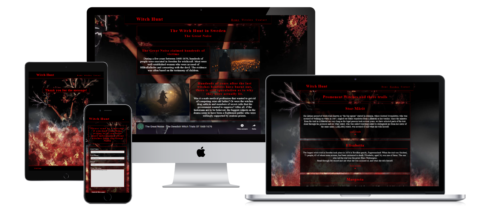

---
---

## User Stories

### First Time Visitor Goals:
* As a First Time Vistior, I want to easily understand the mainn purpose of the site, so I can learn more about the content.
* As a First Time Visitor, I want to be able to easily navigate through the website, so i can find the content.

### Returning Visitor Goals
* As a Returning Visitor, I want to be able to read more in dept records about trails and first hand writings.

## Features

+ ### Navbar

+ ##### Navigation
    - Positioned at the top of the page.
    - Contains logo on the left side.
    - Contains navigation links on the right side:
        * HOME - leads to the Home page
        * WITCHES - leads to the page where you can read about witches and there trails.
        * CONTACT - leads to the contat page where you can contact the site owner.
    - The links have animated hover effects.

    - The  navigation is clear to understand for the user.
    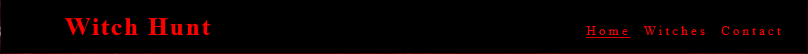

    - The navigation bar is responsive:
        
        * On mobile devices:

            * On Mobile: Navigation bar is filled with the  logo to the right and a caret-down menu  implemented on the right side.
            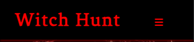

            * When caret-down menu is clicked, there is a   dropdown menu with the links.
            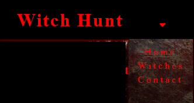

        * On tablets: Navigation bar looks the same as on desktop
        

---
+ ### Home Page:

    - Background image is put in the html body of the page

    - Represent:

        * The consept of the page
        * Invite intrest to read more

    - The page is responsive on all common screen sizes.

        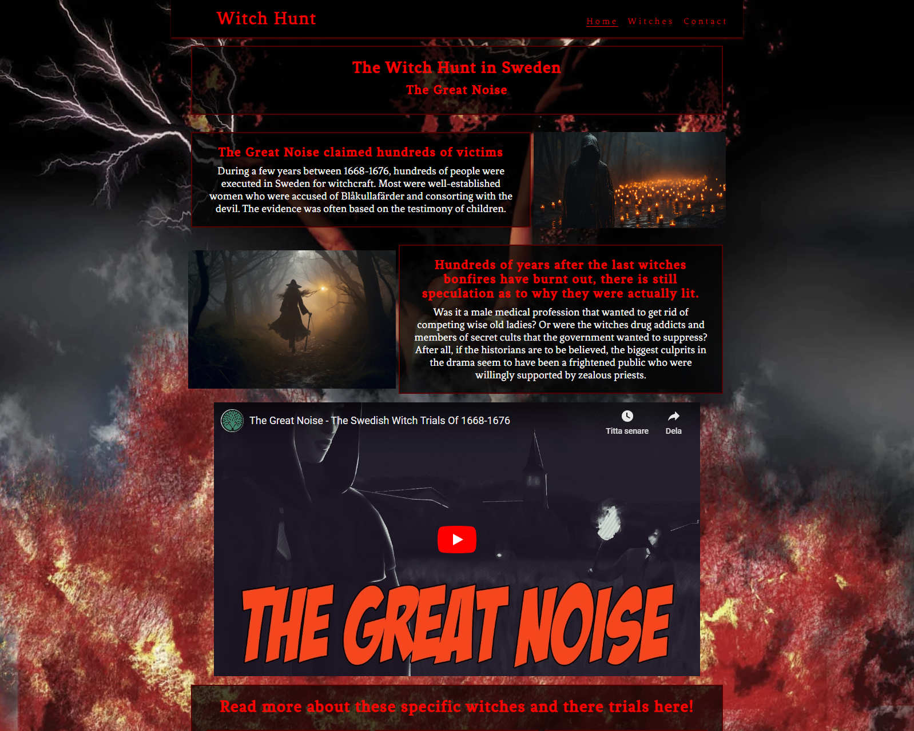

---

+ #### Hero Section

    - Hero section consist of 3 text bracets 
    and on screen bigger than 768px 2 image

        * Page titel introducing the great noise
        * Information about how many victims and a image 
        * Information about the resoning and questions of why and a image

    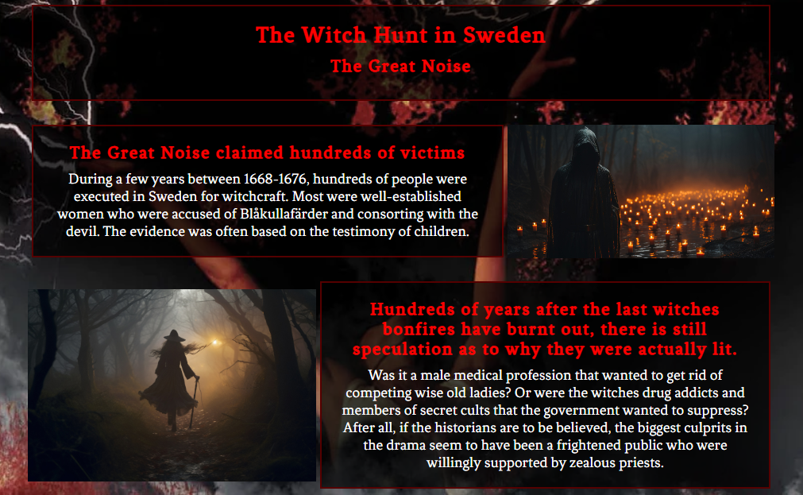

--- 

+ #### Video Section

    - Titel to let user know there are a video about the Great noise to see here

    - Showes a video about the great noise

    
    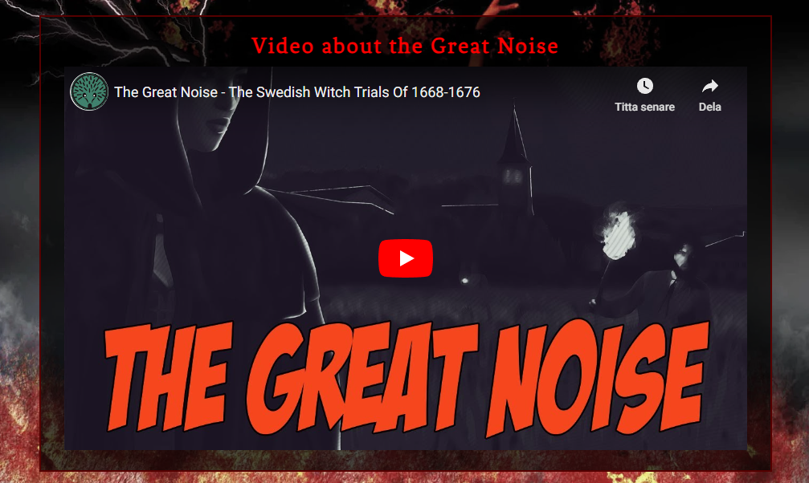

---

+ #### Witches section

    - Titel telling user that here they can be directed to read more about 3 specific witches and there trails

    - Indication to read more about Stor-Märit from Lillhärdal 

    - Indication to read more about Elisabetta from Näs

    - Indication to read more about Margreta from Sund

    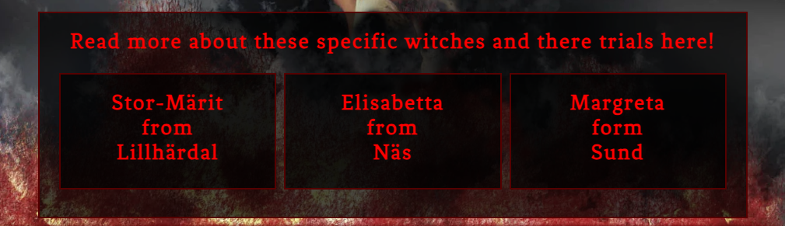

---
+ #### Footer

    - Footer contains social media links that open in a new tab.
​
    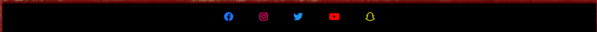
​
---
+ ### Witches Page

    - Same background image on this site as on Home page.

    - Witches page have a titel to intruduce the page and tell the user that on this page you can read about promenent witches and there trails.

    - 3 sections each about a different witche and a introduction about them and a translation about there trails in a extention with a hover function. 
        
        * Each trail section have a link to where the information originated and telling the user that the link is in swedish.

        * Each trail section have a back to top button to take them back to the top of the witches page.

    - The page is responsive on all common screen sizes.
    
    - It has a footer identical to the home page's footer.

    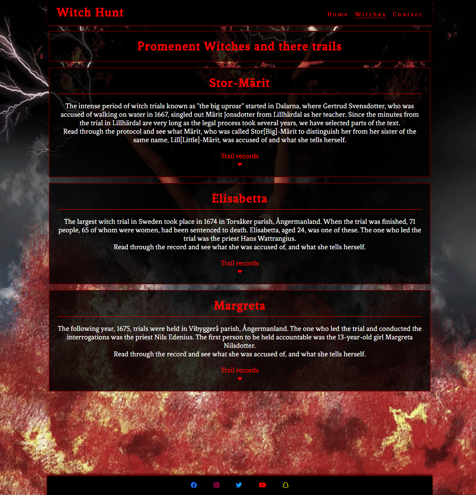

---
+ ### Contact page

    - Contact page has a contact form:

        - All text input fields are accuiered.
        - All inputs are set to be required to fill out.
        - The submit button is animated on hover.

    - The page is responsive on all common screen sizes.

    - The submit button leads to the response page.

    - It has a footer identical to the home page's footer.
​

    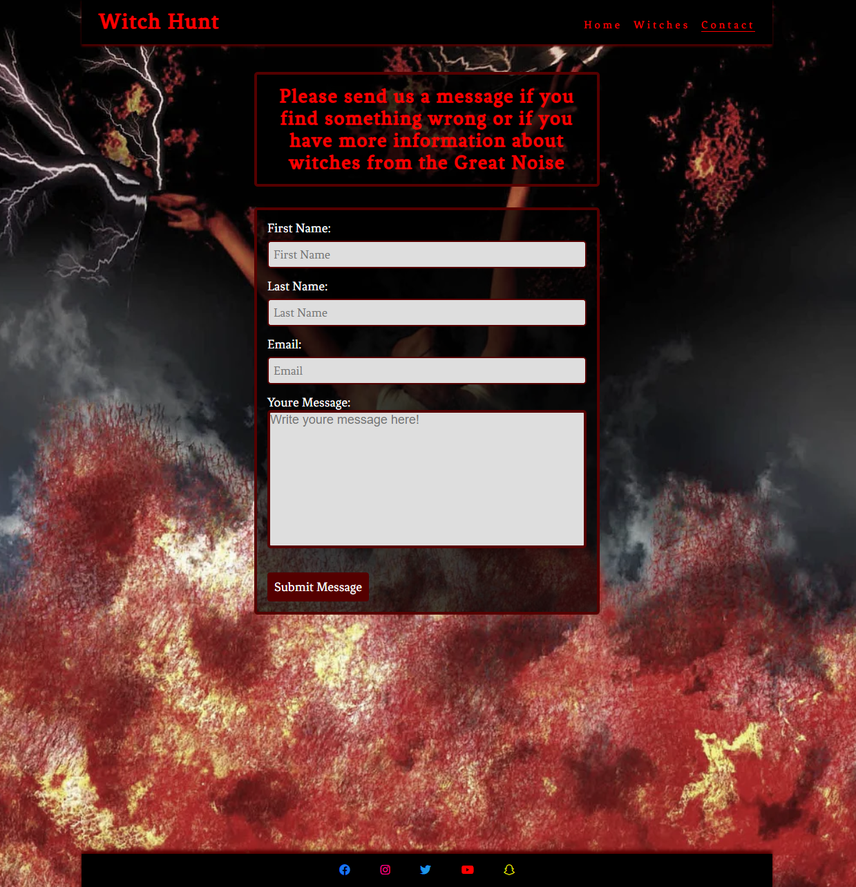

---
+ ### Response page

    - Response page appears after submitting the contact form.
    - It contains the thank you message.
    - It will automatically direct the user to the main page in 10 seconds.

    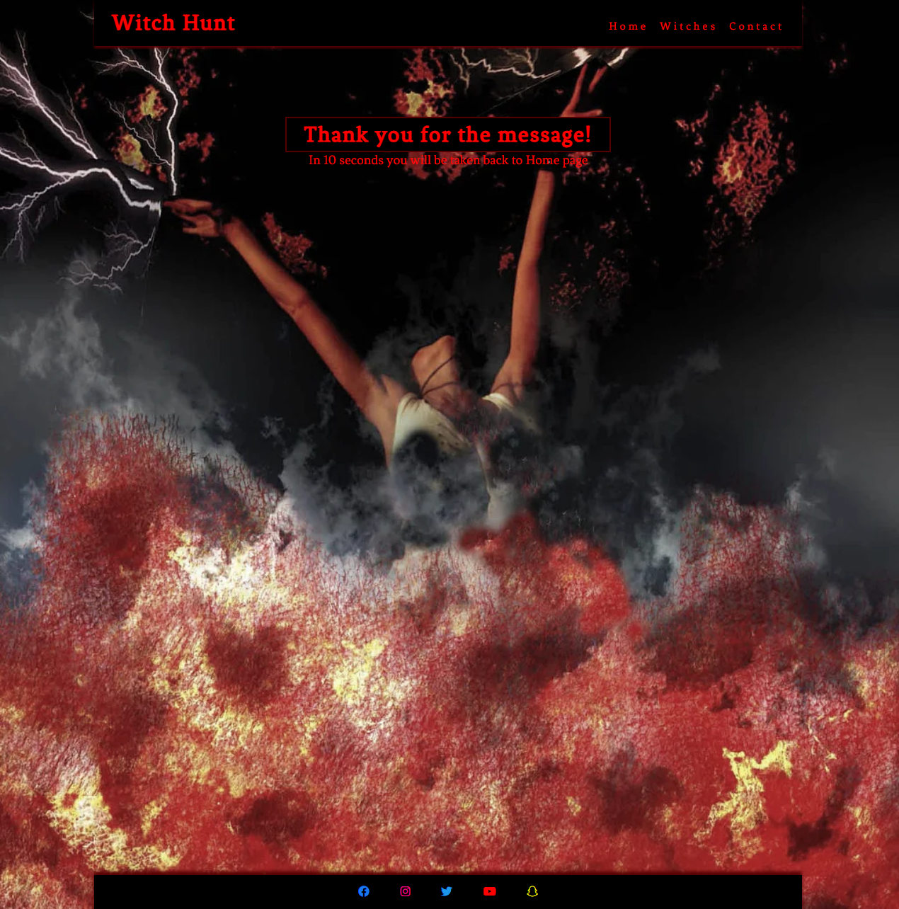

---
## Technologies Used

- [Fontawesome](https://fontawesome.com/) was used for all icons.
- [Favicon](https://icons8.com/icons/set/witch) was used to ad a icon in the tab.
- [HTML](https://developer.mozilla.org/en-US/docs/Web/HTML) was used as the foundation of the site.
- [CSS](https://developer.mozilla.org/en-US/docs/Web/css) - was used to add the styles and layout of the site.
- [CSS Flexbox](https://developer.mozilla.org/en-US/docs/Learn/CSS/CSS_layout/Flexbox) - was used to arrange items simmetrically on the pages.
- [CSS Grid](https://developer.mozilla.org/en-US/docs/Web/CSS/grid) - was used to make "gallery" and "contact" pages responsive.
- [CSS roots](https://developer.mozilla.org/en-US/docs/Web/CSS/:root) was used to declaring global CSS variables and apply them throughout the project. 
- [VSCode](https://code.visualstudio.com/) was used as the main tool to write and edit code.
- [Git](https://git-scm.com/) was used for the version control of the website.
- [GitHub](https://github.com/) was used to host the code of the website.
- [Photoshop](https://www.adobe.com/products/photoshop.html) was used resize images for the README file.

---
## Design

### Color Scheme

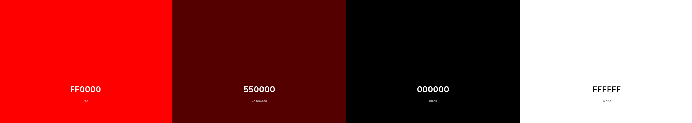 

- Red was used as the main color of this website because of its brightness and eye catching to make the text easy to read and make the user more emotinal. As the color is associated with such opposite emotions as love and hate.

- Black is used as the background color since it is often correlated with power, elegance, sophistication, and depth.

- Rosewood  color was used becouse it's association with strength, open-mindedness, and receptivity.

- White color was used to lighten the website by symbolizes purity and innocence. 

### Typography

- Fenix Google Font was used as the main font of the website in order to increase readability of the content on the pages.

- And in case of problems with Fenix sans-serif was inputted as a backup.

### Wireframes

#### Mobile devices

- [Home Page. Mobile Screen](documentation/mobile-home.png)
- [Witches Page. Mobile Screen](documentation/mobile-witches.png)
- [Contact Page. Mobile Screen](documentation/mobile-contact.png)
- [Response Page. Mobile Screen](documentation/mobile-response.png)

#### Tablets

- [Home Page. Tablet Screen](documentation/tablet-home-page.png)
- [Witches Page. Tablet Screen](documentation/tablet-witches-page.png)
- [Contact Page. Tablet Screen](documentation/tablet-contact-page.png)
- [Response Page. Tablet Screen](documentation/tablet-response-page.png)

#### Desktop

- [Home Page. Desktop Screen](documentation/desktop-home-page.png)
- [Witches Page. Desktop Screen](documentation/desktop-witches-page.png)
- [Contact Page. Desktop Screen](documentation/desktop-contact-page.png)
- [Response Page. Desktop Screen](documentation/desktop-response-page.png)

---

## Testing

## Validator testing
+ ### HTML
  #### Home Page
    - No errors or warnings were found when passing through the official W3C validator.

    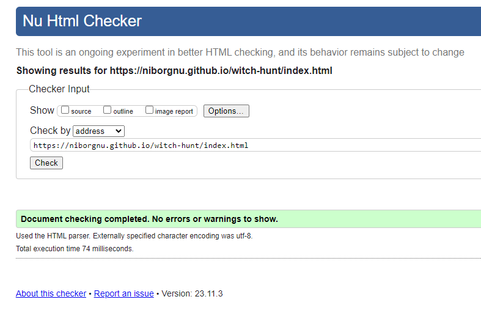
    
  #### Witches Page
    - No errors or warnings were found when passing through the official W3C validator.

    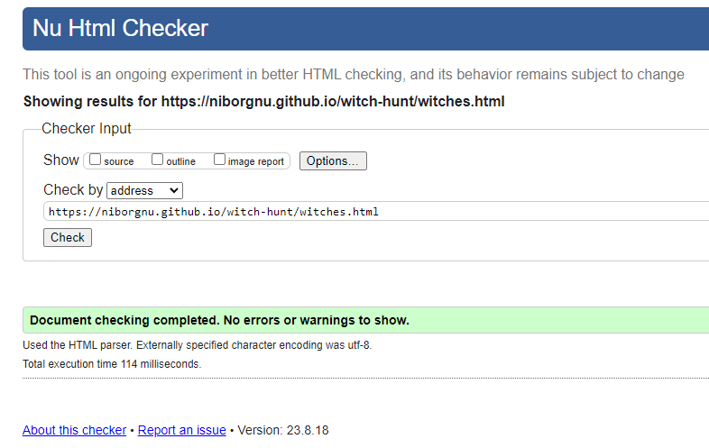

  #### Contact Page
    - No errors or warnings were found when passing through the official W3C validator.

    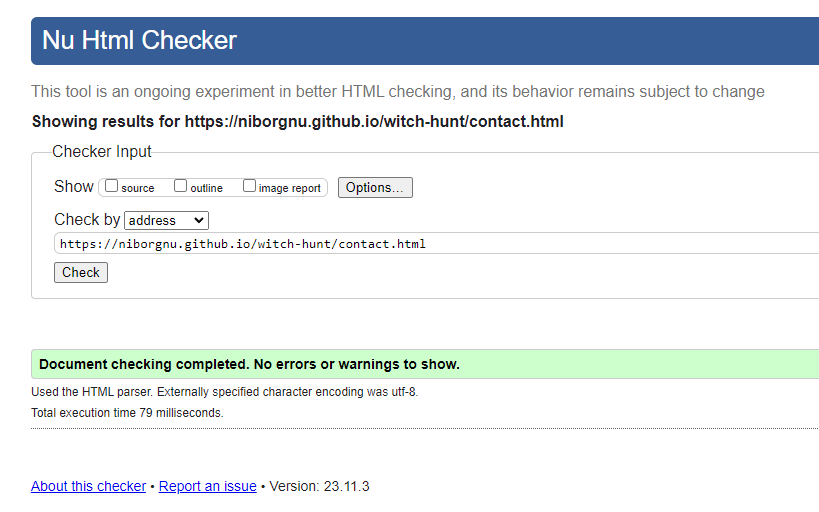

  #### Response Page
    - No errors or warnings were found when passing through the official W3C validator.

    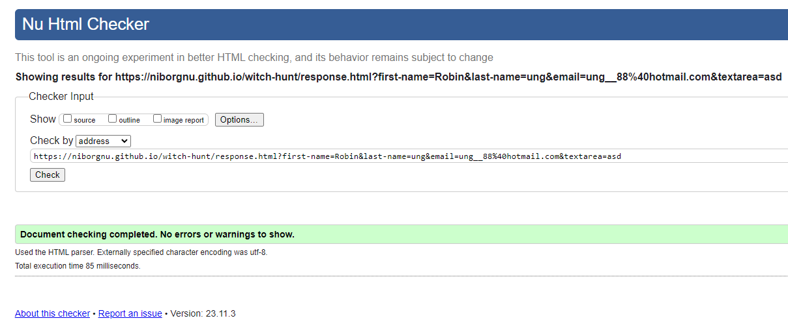
    
+ ### CSS
    - No errors or warnings were found when passing through the official W3C (Jigsaw) validator

  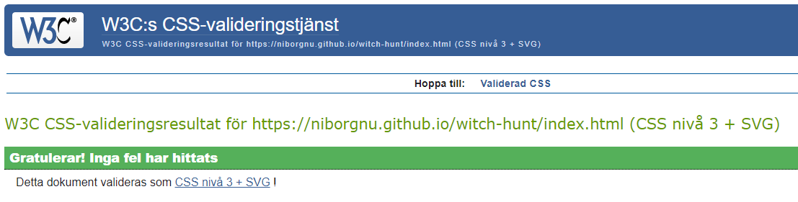

### Compatibility And Responsiveness

In order to confirm the correct functionality, responsiveness, and appearance:

+ [Responsive Website Design Tester](https://responsivedesignchecker.com/) Was used to test responsiveness

+ The website was tested on the following browsers: Chrome, Firefox, Edge

    - Chrome

    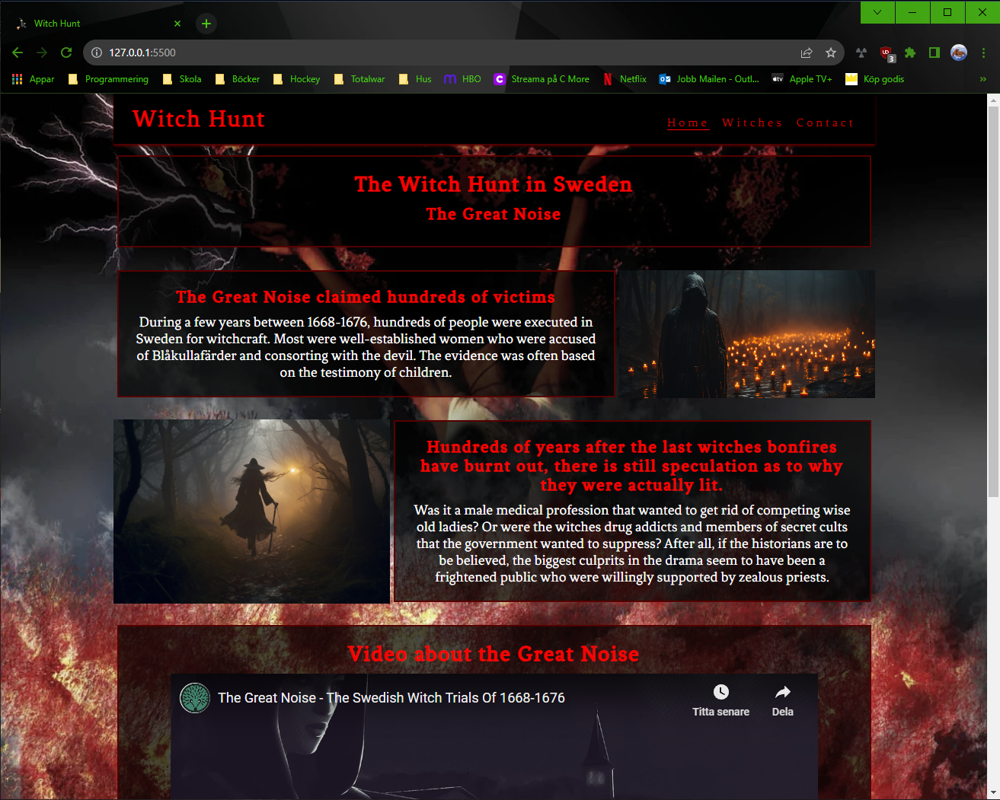

    - FireFox

    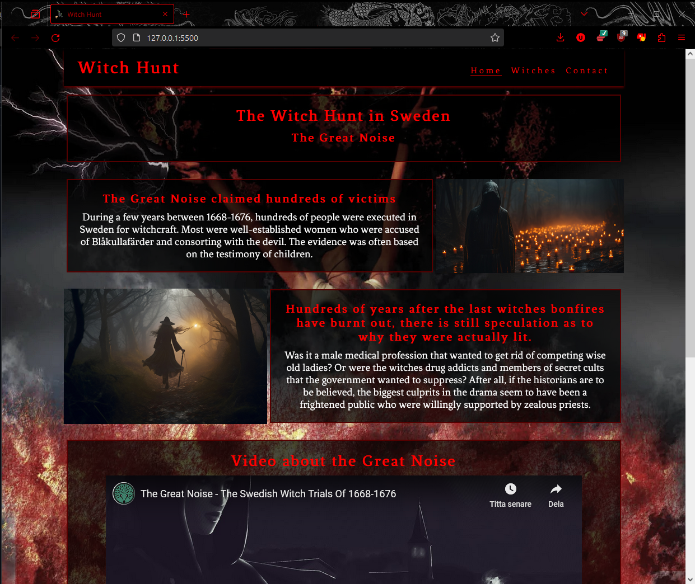

    - Edge

    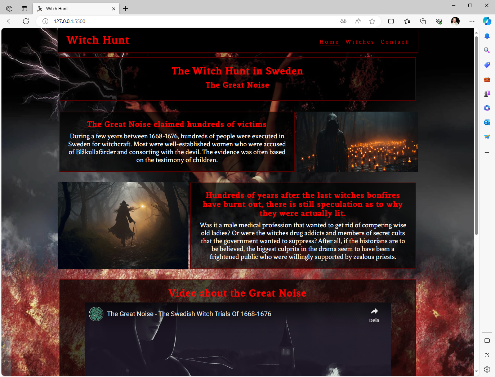

---

## Manual testing

| feature | action | expected result | tested | passed | comments |
| --- | --- | --- | --- | --- | --- |
| Navbar | | | | | |
| Home | Click on the "Home" link | The user is redirected to the main page | Yes | Yes | - |
| Witches | Click on the "Witches" link | The user is redirected to the witches page | Yes | Yes | - |
| Contact | Click on the "Contact" link | The user is redirected to the contact page | Yes | Yes | - |
| Footer | | | | | |
| Instagram icon in the footer | Click on the Instagram icon | The user is redirected to the Instagram page | Yes | Yes | - |
| Facebook icon in the footer | Click on the Facebook icon | The user is redirected to the Facebook page | Yes | Yes | - |
| Twitter icon in the footer | Click on the Twitter icon | The user is redirected to the Twitter page | Yes | Yes | - |
| YouTube icon in the footer | Click on the YouTube icon | The user is redirected to the YouTube page | Yes | Yes | - |
| Home page | | | | | |
| "Video" button in video section | Click on the "Video" button | The user started the video | Yes | Yes | - |
| Witches page | | | | | |
| "Witches" button in stor-marit section | Click on the "records" button | The user see the extention | Yes | Yes | Icon not responsive to know text is showing. Will fix when learned how in js |
| "Source" button in record-marit section | Click on the "Source" button | The user opens source in new tab | Yes | Yes | - |
| "Back to top" button in record-marit section | Click on the "Back to top" button | The user was moved back to header | Yes | Yes | - |
| "Witches" button in elisabetta section | Click on the "records" button | The user see the extention | Yes | Yes | Icon not responsive to know text is showing. Will fix when learned how in js |
| "Source" button in record-elisabetta section | Click on the "Source" button | The user opens source in new tab | Yes | Yes | - |
| "Back to top" button in record-elisabetta section | Click on the "Back to top" button | The user was moved back to header | Yes | Yes | - |
| "Witches" button in margreta section | Click on the "records" button | The user see the extention | Yes | Yes | Icon not responsive to know text is showing. Will fix when learned how in js |
| "Source" button in record-margreta section | Click on the "Source" button | The user opens source in new tab | Yes | Yes | - |
| "Back to top" button in record-margreta section | Click on the "Back to top" button | The user was moved back to header | Yes | Yes | - |
| Contact page | | | | | |
| First name input | Enter the first name | The first name is entered | Yes | Yes | If user doesn't enter the first name, the error message appears |
| Last name input | Enter the last name | The last name is entered | Yes | Yes | If user doesn't enter the last name, the error message appears |
| Email input | Enter the email | The email is entered | Yes | Yes | If user doesn't enter the email, the error message appears. |
| Enter message in textarea | Enter message | Message was entered | Yes | Yes | If user doesn't enter text, the error message appears. |
| "Submit" button | Click on the "Submit" button | The user is redirected to the response page | Yes | Yes | - |
| Response page | | | | | |
| Response message | The user will be automatically redirected to the home page after 10 seconds | The user is redirected to the home page | Yes | Yes | - |

---

+ ## LightHouse report

    - Using lighthouse in devtools I confirmed that the website is performing well, accessible and colors and fonts chosen are readable.
    
  ### Home page

  - 83 Performance do to imbedded youtube video.

  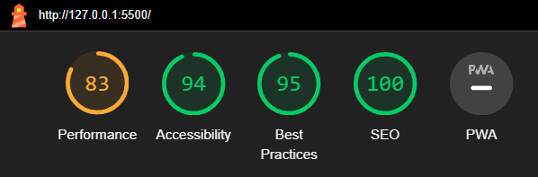

  ### Witches page

  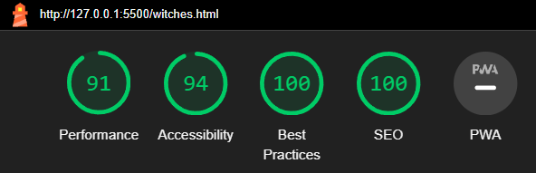

  ### Contact page

  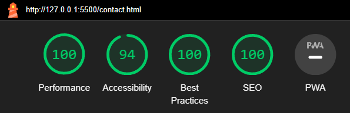

  ### Response page

  - 86 Accessibilite do to refreshing page automatically.

  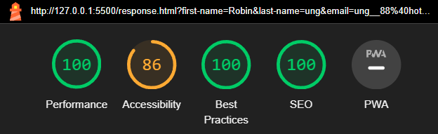

---

## Bugs
+ ### Unsolved bugs
    - None.
+ ### Mistakes
    - Mistakes were made while committing changes
        * One commit to long
        * I used past tense in commit before I learned to not do that

---

## Deployment

### Deployment to GitHub Pages

- The site was deployed to GitHub pages. The steps to deploy are as follows: 
  - In the [GitHub repository](https://github.com/NiborGnu/witch-hunt), navigate to the Settings tab 
  - From the source section drop-down menu, select the **Main** Branch, then click "Save".
  - The page will be automatically refreshed with a detailed ribbon display to indicate the successful deployment.

The live link can be found [here](https://niborgnu.github.io/witch-hunt/index.html)

### Local Deployment

- If you use Gitpod, you can [click here](https://gitpod.io/#https://github.com/NiborGnu/witch-hunt), which will start the Gitpod workspace for you.

---

## Future improvements

- add javascript indicator to witches record extendsion
- add custom 404 page;
- add accessability report with [WAVE Web Accessibility Evaluation Tool](https://wave.webaim.org/);
- add fully functional contact form.

---
## Credits

+ #### Content

    - Inspiration for the responsive hamburger navbar came from [Kevin Powell](https://www.youtube.com/user/KepowOb) on his YouTube channel.

+ #### Media

    - All the images for the website were taken from [Freepik](https://www.freepik.com/) and [Pixabay](https://pixabay.com/).

    + Body Background Image:
        
        - [Witch Burning](https://pixabay.com/illustrations/witch-burning-funeral-pyre-phoenix-351208/)

    + Home images:
        - [1st image](https://www.freepik.com/free-ai-image/medium-shot-scary-character-posing_59233389.htm#query=witches%20burning&position=26&from_view=search&track=ais)
        - [2nd image](https://www.freepik.com/free-ai-image/view-daunting-witch-character_58508538.htm#query=witch%20burning&position=46&from_view=keyword&track=ais);

    - [Video](https://www.youtube.com/watch?v=QnBupvZoTw8) Taken from you tube user Pinnso

+ #### Tools

    - [Photoshop](https://www.adobe.com/products/photoshop.html) was used to edit all images.

+ #### Inspiration

    * [Code Institute](https://codeinstitute.net/se/) - Fore the training and classes in all the basics of html  and css
    
    * [Kevin Powell](https://www.youtube.com/@KevinPowell) - Fore awesome ccs tutorials

    * [National Archive Sweden](https://riksarkivet.se/motkallorna/rattegangsprotokollen) - For the Trail records I translated from there

    * [Pinnso](https://www.youtube.com/watch?v=QnBupvZoTw8) - Fore the video I link on my home page about the Great Noise

    * [Fontawesome](https://fontawesome.com/search?q=more&o=r&m=free) - Fore the nice Icons I have been using that they have