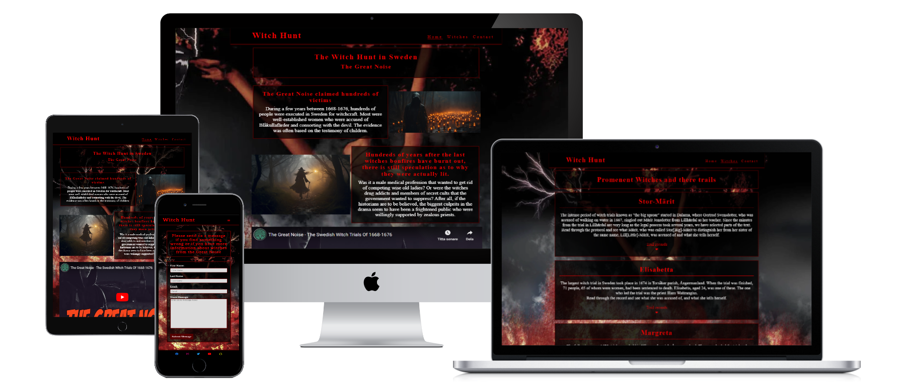
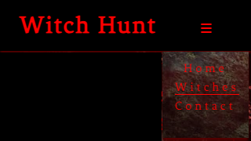

# Witch Hunt

The witch hunt website is made to informe people about the witch hunt in sweden called "the great noise". With information from that time and records of 3 trails at that time.

The site can be viewed on github pages [here](https://niborgnu.github.io/witch-hunt/)

---
---

## User Stories

### First Time Visitor Goals:
* As a First Time Vistior, I want to easily understand the mainn purpose of the site, so I can learn more about the content.
* As a First Time Visitor, I want to be able to easily navigate through the website, so i can find the content.

### Returning Visitor Goals
* As a Returning Visitor, I want to be able to read more in dept records about trails and first hand writings.

## Features

+ ### Navbar

+ ##### Navigation
    - Positioned at the top of the page.
    - Contains logo on the left side.
    - Contains navigation links on the right side:
        * HOME - leads to the Home page
        * WITCHES - leads to the page where you can read about witches and there trails.
        * CONTACT - leads to the contat page where you can contact the site owner.
    - The links have animated hover effects.

    - The  navigation is clear to understand for the user.
    

    - The navigation bar is responsive:
        
        * On mobile devices:

            * On Mobile: Navigation bar is filled with the  logo to the right and a caret-down menu  implemented on the right side.
            

            * When caret-down menu is clicked, there is a   dropdown menu with the links.
            

        * On tablets: Navigation bar looks the same as on desktop
        

---
+ ### Home Page:

    - Represent:

        * The consept of the page
        * Invite intrest to read more

        

+ ### Acknowledgments

    * [Code Institute](https://codeinstitute.net/se/) - Fore the training and classes in all the basics of html  and css
    
    * [Kevin Powell](https://www.youtube.com/@KevinPowell) - Fore awesome ccs tutorials

    * [National Archive Sweden](https://riksarkivet.se/motkallorna/rattegangsprotokollen) - For the Trail records I translated from there

    * [Pinnso](https://www.youtube.com/watch?v=QnBupvZoTw8) - Fore the video I link on my home page about the Great Noise

    * [Google Fonts](https://fonts.google.com/specimen/Fenix?query=fenix) - Fore the fonts I'm using from them

    * [Fontawesome](https://fontawesome.com/search?q=more&o=r&m=free) - Fore the nice font I have been using that they have

    * [Freepik](https://www.freepik.com/) - Fore the image they have are awesome

    * [Juliia](https://github.com/IuliiaKonovalova) - Fore the help and guidens